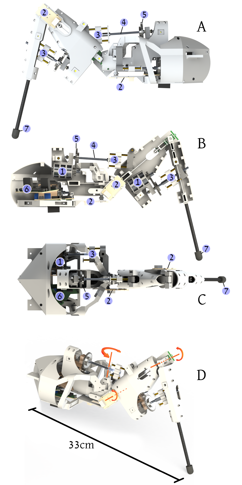

<table border="0">
 <tr>
    <td><td><h1> Pohod15Leg </h1>
    CAD views of the Pohod15 bio-inspired leg. (1) DC motor (2) Angle (3) Force sensor (4) Worm gear (5) Straight gear (6) Control circuit (7) Silicone tip.    
      

      
    

    </td></td>
    <td>
    <h1> Description: </h1>
    This project presents the design of a 3 DoF bio-inspired robotic leg. The desert ant <i>Cataglyphis fortis</i> was used as a reference for segment sizing, with a scale ratio of 1:30.  
The structure is mainly composed of FDM 3D-printed parts. An additional carbon fiber shaft is used for the tibia, and a silicone molded tip improves surface adherence.   
The actuation system consists of 3 DC motors (MABUCHI RK-370CC-14230), controlled with a custom-built shield made of L298N. However, nowadays, there are good Pololu control boards available (<a href="https://www.pololu.com/category/10/brushed-dc-motor-controllers">Pololu control boards</a>).   
An irreversible worm-gear system is built using custom-machined axes jointed to Delrin straight gears to double the motor's torque output. These parts can also be assembled from cut threaded rods.   
Angular sensors are based on the AS5600 from AMS OSRAM manufacturer.   
    <h1>  Files: </h1>
    <h3>./Pohod15ExoC</h3>
              CAD assembly files for Solidworks. An aditional .STEP model is provided.
    <h3>./ActuatorControl</h3>
              Provide the STM32 code, for actuator position control, 3DoF leg inverse kinematics and trajectory generation.    
              The projet was configured using STM32CubeMX software (NUCLEO STM32F411RE setup). We suggest to use STM32Studio for the code developpment.   
    <h3>./Joint sizing  </h3> 
              Provide a graphical software to choose manually the optimum size of the irreversible joint, depending the desired output torque.
    </td>
 </tr>
</table>

  
## Want to learn more about hexapod robotics?  
- Brodoline, I., Sauvageot, E., Viollet, S., Serres J. R., Shaping the energy curves of a servomotor-based hexapod robot. Sci Rep 14, 11675 (2024).
  <a href="https://doi.org/10.1038/s41598-024-62184-y">https://www.nature.com/articles/s41598-024-62184-y</a>
- Manoonpong P, Patanè L, Xiong X, Brodoline I, Dupeyroux J, Viollet S, Arena P, Serres JR. Insect-Inspired Robots: Bridging Biological and Artificial Systems. Sensors. 2021; 21(22):7609.
<a href="https://www.mdpi.com/1424-8220/21/22/7609">https://doi.org/10.3390/s21227609</a>  
 
        
